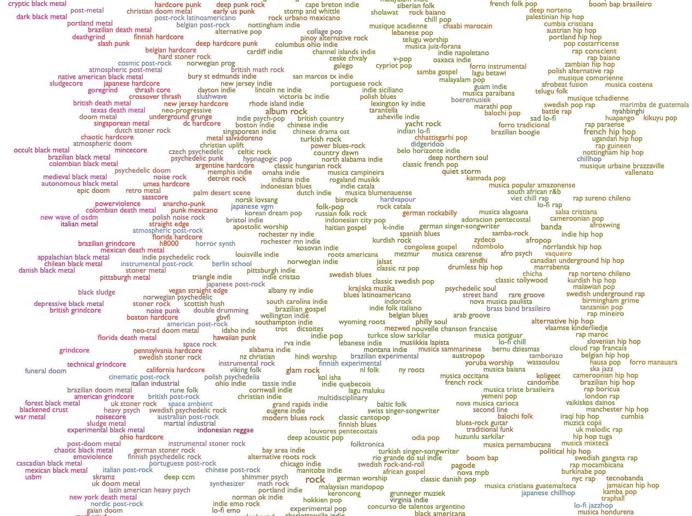

# AnaLyrics Engine: Predicting Music Genres with NLP

Meghana Pakala

February 2024

## Business Understanding

This project leverages song lyrics and metadata to classify songs into distinct music genres. Genre classification is not an exact science, and given the vast diversity of music today, there are innumerable categories a song could belong to.

As a passionate music lover and avid concert goer, I tend to have a curated playlist for every possible mood and occassion. This is a tedious task to do manually, and I have often thought how nice it would be to be able to input my current mood and desired music style (ex: sad bangers) and have a playlist made personally for me.

Spotify has attempted to do this with their [daylist](https://newsroom.spotify.com/2023-09-12/ever-changing-playlist-daylist-music-for-all-day/)- a personalized playlist that "ebbs and flows with unique vibes, bringing together the niche music and microgenres you usually listen to during particular moments in the day or on specific days of the week."

The daylist updates organically throughout the day and is based on your past listening habits. This project attempts to build on that concept by curating a playlist based on a user's desired vibe. In order to get to an end goal of song recommendations based on lyrics and audio features, the first step was to build a supervised model trained to predict a song's genre based purely on the words it contains.

## Data Collection

The first step in building the dataset was identifying the prediction target- music genres. As with any field that is an art and not a (data) science, the groundtruth for genre classification is fairly subjective.

[Every Noise At Once](https://everynoise.com/engenremap.html) is “an ongoing attempt at an algorithmically-generated, readability-adjusted scatter-plot of the musical genre-space." The project was created in 2013 by Glenn McDonald, a former Spotify developer, based on data tracked and analyzed for ~6000 Spotify genres. 

For the purposes of lyric classification, I chose to use the most popular distinct genre groupings- pop, rock, hip hop, and country- and the songs for each genre were collected from the playlists provided by the Every Noise project.

Song metadata and audio features were gathered using [Spotipy](https://spotipy.readthedocs.io/en/2.22.1/), a Python wrapper for the [Spotify API](https://developer.spotify.com/documentation/web-api). Lyrics for each song were scraped from [Genius](https://genius.com) using [LyricsGenius](https://lyricsgenius.readthedocs.io/en/master/reference/genius.html). 

The scraped lyrics required preliminary text cleaning to remove extraneous content and bad records. After combining and cleaning the data, we were left with 2,024 songs for modeling.

The Python files for collecting and cleaning the lyrics are available in the code folder:
- [Spotify metadata](code/1_spotify.py)
- [Genius lyrics](code/2_genius.py)
- [text cleaning](code/3_text_cleaning.ipynb)

A deeper dive into the data and exploratary visuals are available [here](code/eda.ipynb).

## Modeling

The full modeling pipeline including preprocessing and and classification can be viewed in the [final notebook](capstone.ipynb)

To prepare the data, we performed preprocessing steps such as removing special characters and stop words, tokenization, and lemmatization of lyrics. 

After exploring some simple modeling techniques, we found that there was heavy overfitting across the board- given this is a fairly small dataset with an average of 500 songs per genre, the models tended to perform much better on the training data than on unseen lyrics.

Along with tuning the chosen models, we tested different parameters for vectorization and resampling, which only slightly improved overfitting.

# Evaluation & Next Steps

In evaluation the final models, we found that a random forest provided the highest overall accuracy with 67%. However this may not be the preferred option as the accuracy of the classifications was heavily skewed in certain genres (rock and hip hop) compared to others. 
Naive Bayes overall accuracy dropped to 56%, but it was slightly more balanced across genres.

To improve this model, we would need to collect a larger variety of lyrics to address sample size issues. We can also consider limiting the time frame as language evolution may be a factor in prediction accuracy.For expanded analysis, we can also combine audio features such as acoustics and tempo to focus on the song structure.